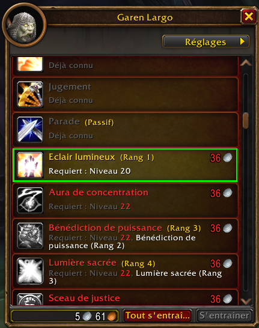

# SkillsAlreadyKnown

Small WoW Forever addon that makes the class trainer list easier to scan.

## What It Does

- Known trainer spells are shown in grey.
- Spells locked by character level are shown in red.
- Spells that can be learned now get a green outline.
- Icons are left untouched.

The addon uses trainer API state such as `available`, `used`, and level requirements instead of matching localized text, so it should behave cleanly across client languages.

## Preview



## Compatibility

Built for WoW Forever / Camelot:

```toc
## Interface: 16001
## AllowLoadGameType: camelot
```

## Install

Place the folder here:

```text
World of Warcraft/_classic_beta_/Interface/AddOns/SkillsAlreadyKnown
```

Then enable **Skills Already Known** in the in-game AddOns list and reload/restart the client.

## Command

```text
/sak
```

Forces a refresh and prints the current color legend.

## License

MIT
